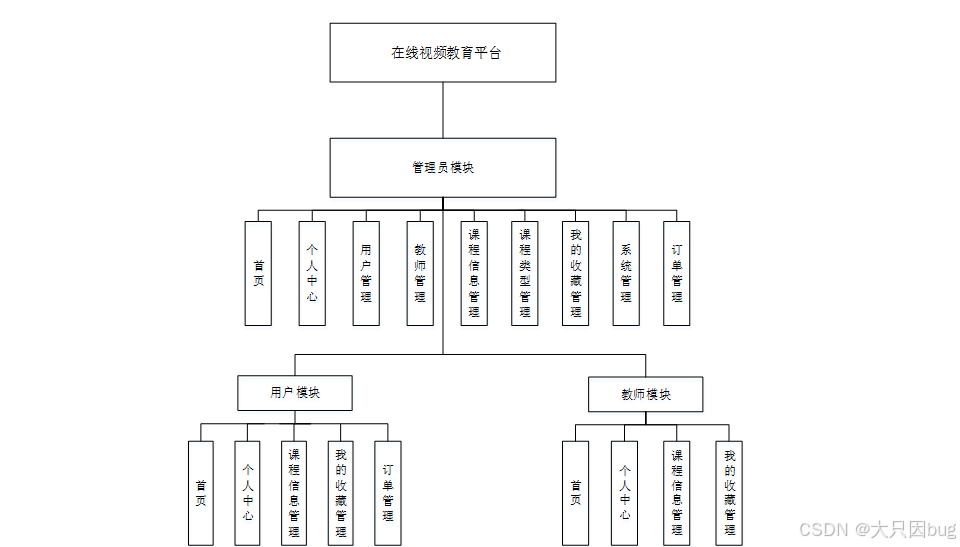

# 基于SpringBoot的在线视频教育平台

#### 介绍
基于SpringBoot的在线视频教育平台源码，后端使用Springboot+mybatis，前端使用vue+html，数据库使用mysql，采用智能排序进行推荐。

## 基于SpringBoot的在线视频教育平台的设计与实现
**开发环境**
开发语言：Java
框架：springboot
JDK版本：JDK1.8
服务器：tomcat7
数据库：mysql 5.7
数据库工具：Navicat11
开发软件：idea

源码获取：[SpringBoot在线视频教育平台源码](https://gitee.com/ss-i-gg/Online-video-education-platform-based-on-SpringBoot/raw/master/%E5%9C%A8%E7%BA%BF%E8%A7%86%E9%A2%91%E6%95%99%E8%82%B2%E5%B9%B3%E5%8F%B0%E6%BA%90%E7%A0%81.zip)

**系统功能介绍**
在线视频教育平台主要功能如下：
1.用户管理：注册、登录、退出、修改密码；
2类显示：显示课程的分类；
3.课程显示：按分类查询课程、按教师查询课程、通过关键字搜索课程、查看课程的详细信息；
4.购物车管理：向购物车中添加课程、删除购物车中课程、我的购物车；
5.订单管理：通过购物车中生成订单、查看我的订单、查看某个订单的详细、订单支付、取消未付款订单。
6.首页：提供一个网站首页，该网站用户的登录，注册，所有课程的一级分类，热门课程和最新课程的展示等。
7.课程管理：课程的审批、上架、下架。
8.教师管理：课程的上传、下架。

9.后端使用Springboot+mybatis，前端使用vue+html，数据库使用mysql，采用智能排序进行推荐

**系统结构图**

**数据库设计：**

**项目开发结构**

**系统功能展示**
前台用户

**后台管理员登录**

源码获取：[SpringBoot在线视频教育平台源码](https://gitee.com/ss-i-gg/Online-video-education-platform-based-on-SpringBoot/raw/master/%E5%9C%A8%E7%BA%BF%E8%A7%86%E9%A2%91%E6%95%99%E8%82%B2%E5%B9%B3%E5%8F%B0%E6%BA%90%E7%A0%81.zip)
